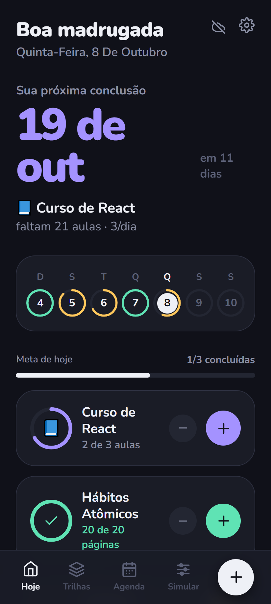
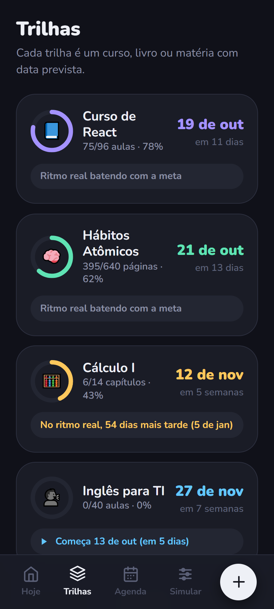
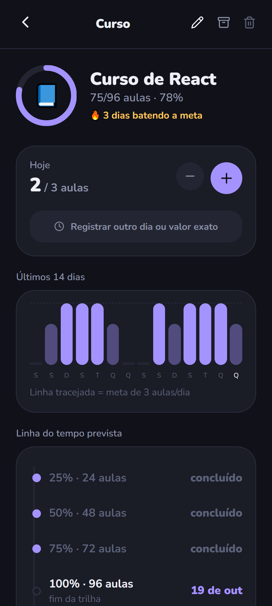
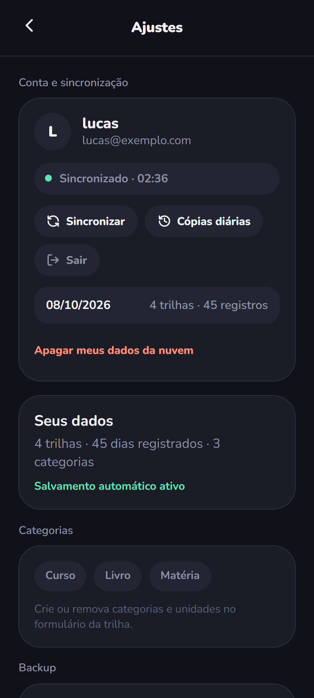
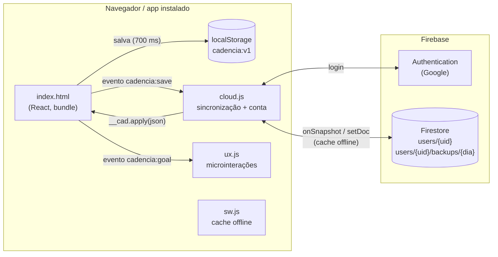

<div align="center">


# Cadência

**Projeta quando você termina cada curso, livro ou matéria — a partir da sua meta diária e do ritmo que você sustenta de verdade.**

[](https://github.com/lucasmks7/cadencia/actions/workflows/ci.yml)


[](LICENSE)

[**Abrir o app**](https://cadencia-app-lm.web.app) · [Espelho no GitHub Pages](https://lucasmks7.github.io/cadencia/) · [Arquitetura](docs/ARQUITETURA.md) · [Sincronização](docs/SINCRONIZACAO.md)

</div>

<p align="center">
  
  
  
  
</p>

## O problema

Planilhas e apps de hábito dizem *quanto* você estudou, mas não *quando* você vai terminar. O Cadência responde a essa pergunta para cada trilha (um curso, um livro, uma matéria) e compara a data **planejada** com a data que o seu **ritmo real** indica, avisando cedo quando as duas começam a se afastar.

## Funcionalidades

- **Projeção de término** por trilha, contando só os dias da semana em que você estuda e descontando o que já foi feito hoje.
- **Ritmo real × meta:** média móvel exponencial dos últimos 21 dias, com faixa otimista/pessimista e alerta ("no ritmo real, 54 dias mais tarde").
- **Simulador:** escolha o ritmo e veja a data, ou escolha a data e veja o ritmo necessário. Nada é salvo até você aplicar.
- **Agenda** mensal com o que foi registrado e o que está planejado.
- **Login com Google e sincronização em tempo real** entre celular, tablet e computador.
- **Funciona offline:** as alterações entram numa fila e sobem quando a internet volta.
- **Mesclagem de conflitos** quando dois aparelhos editaram offline, sem perder registros.
- **Cópias diárias automáticas na nuvem** (últimos 30 dias), restauráveis pelo app.
- **Instalável como app** (PWA), em tela cheia, com ícone na tela inicial.
- **Microinterações:** entrada em cascata, barras que deslizam, confete e vibração ao bater a meta. Tudo respeita *reduzir movimento*.

## Stack

| Camada | Tecnologia |
|---|---|
| Interface | React 18, CSS puro, fonte Nunito embutida; empacotada com **esbuild** num único `index.html` |
| Autenticação | **Firebase Authentication** (provedor Google; popup com fallback para redirect) |
| Banco de dados | **Cloud Firestore** com cache persistente offline (IndexedDB) e listener em tempo real |
| Segurança | **Firestore Security Rules** com validação de dono, esquema e tamanho |
| Offline / instalação | **Service Worker** próprio (*stale-while-revalidate*) + Web App Manifest |
| Hospedagem | **Firebase Hosting** (principal) e **GitHub Pages** (espelho) |
| Testes | `node:test` (unitários) + `@firebase/rules-unit-testing` no **emulador do Firestore** |
| CI | **GitHub Actions**: build reproduzível, verificação dos ganchos, testes unitários e de regras |

## Arquitetura



A interface original já existia como um bundle React compilado. Em vez de reescrevê-la, a nuvem e as animações foram acopladas por **ganchos pequenos e explícitos**, aplicados por um script idempotente (`scripts/patch-index.mjs`): uma ponte de estado (`window.__cad`), eventos de salvamento e de meta batida, e pontos de montagem na tela. Detalhes em [docs/ARQUITETURA.md](docs/ARQUITETURA.md).

### Como a sincronização decide

Cada aparelho guarda a **base**: a última versão que ele sabe estar igual no aparelho e na nuvem. Quando chega uma versão da nuvem, o núcleo puro [`src/cloud/sync-core.js`](src/cloud/sync-core.js) compara os três lados (um *merge* de três vias):

| situação | ação |
|---|---|
| só o aparelho mudou desde a base | envia (`push`) |
| só a nuvem mudou | baixa (`pull`) |
| os dois mudaram (edição offline em dois aparelhos) | **mescla**: une trilhas e, no mesmo dia, mantém o maior registro |
| primeiro login no aparelho, com dados dos dois lados | **pergunta** ao usuário: juntar, usar a nuvem ou usar o aparelho |

O algoritmo completo, o modelo de dados e os casos de borda estão em [docs/SINCRONIZACAO.md](docs/SINCRONIZACAO.md).

## Como a projeção funciona

- **Sessões necessárias** = teto(restante ÷ meta diária); o que já foi feito hoje desconta da primeira sessão.
- **Data** = a n-ésima ocorrência de um dia marcado na semana, contada a partir de hoje (ou da data de início, se a trilha for programada).
- **Ritmo real** = média móvel exponencial (α = 0,35) dos últimos 21 dias de estudo, contando os dias zerados.
- **Faixa otimista/pessimista** = ritmo real ± metade do desvio-padrão.
- **Recalibração** = meta + 0,5 × (meta necessária − meta), com salto limitado a ±25%.

## Segurança e privacidade

- Cada conta só lê e escreve `users/{seu uid}` e as próprias cópias diárias; qualquer outro caminho é negado ([`firestore.rules`](firestore.rules)).
- As regras validam o esquema (só os campos esperados) e o tamanho do documento, e são cobertas por testes automatizados.
- As chaves em `firebase-config.js` são identificadores públicos do projeto; a proteção vem das regras.
- Sem login, nada sai do aparelho. O usuário pode apagar todos os dados da nuvem pelo próprio app.

## Rodando localmente

Requisitos: Node 20+ e, para os testes de regras, Java 11+.

```bash
git clone https://github.com/lucasmks7/cadencia.git
cd cadencia
npm install

npm run serve        # abre o app em http://localhost:5173
npm test             # testes unitários + regras do Firestore no emulador
```

Para usar a nuvem com o seu próprio projeto Firebase, siga [docs/CONFIGURACAO.md](docs/CONFIGURACAO.md).

| comando | o que faz |
|---|---|
| `npm run build` | gera `cloud.js` a partir de `src/cloud/` (Firebase embutido, sem CDN) |
| `npm run patch` | (re)aplica os ganchos no `index.html`; rodar duas vezes não muda nada |
| `npm run test:unit` | testa o núcleo da sincronização (decisão e mesclagem) |
| `npm run test:rules` | sobe o emulador do Firestore e testa as regras de segurança |
| `npm run emulators` | Auth + Firestore locais para desenvolver sem tocar na produção |
| `npm run deploy` | build + publica site e regras no Firebase |

## Estrutura

```
.
├── index.html              # app React (bundle) + ganchos de integração
├── cloud.js                # GERADO: login Google + sincronização (src/cloud)
├── ux.js                   # microinterações e escala para celular
├── sw.js                   # service worker (offline, só arquivos do próprio app)
├── firebase-config.js      # identificadores públicos do projeto Firebase
├── manifest.webmanifest    # instalação como app
├── src/cloud/
│   ├── index.js            # Firebase, ciclo de vida da sessão, interface da conta
│   └── sync-core.js        # funções puras: decide() e merge()
├── scripts/
│   ├── build-cloud.mjs     # esbuild → cloud.js
│   └── patch-index.mjs     # aplica os ganchos no index.html (idempotente)
├── tests/
│   ├── sync-core.test.mjs
│   └── firestore.rules.test.mjs
├── firestore.rules         # regras de segurança
├── firebase.json           # hosting, regras e emuladores
└── docs/                   # arquitetura, sincronização, configuração e imagens
```

## Decisões técnicas

- **Firebase em vez de Supabase:** o plano gratuito do Supabase pausa projetos após 7 dias sem uso. O Firestore já traz cache offline com fila de escrita, que este app precisa.
- **Documento único por usuário (string JSON):** o estado inteiro tem poucos KB. Gravar tudo de uma vez evita escritas parciais inconsistentes e simplifica o *merge* de três vias.
- **Firebase embutido no `cloud.js` (sem CDN):** o app abre offline desde a primeira instalação, e o carregamento é `defer`, sem atrasar a primeira pintura.
- **Service worker só para a própria origem:** requisições do Google e do Firestore nunca são servidas do cache, o que evitaria dados antigos.
- **Login por popup, com redirect como fallback,** e `authDomain` no mesmo domínio do Hosting, para não depender de cookies de terceiros.

## Roadmap

- [ ] Extrair e versionar o código-fonte da interface React (hoje o repositório guarda o bundle compilado).
- [ ] Deploy automático no Firebase Hosting pelo GitHub Actions.
- [ ] Mesclagem por campo com carimbo de tempo por trilha, para resolver também edições de título e meta.
- [ ] Tema claro.

## Licença

[MIT](LICENSE) © LucasMks7
