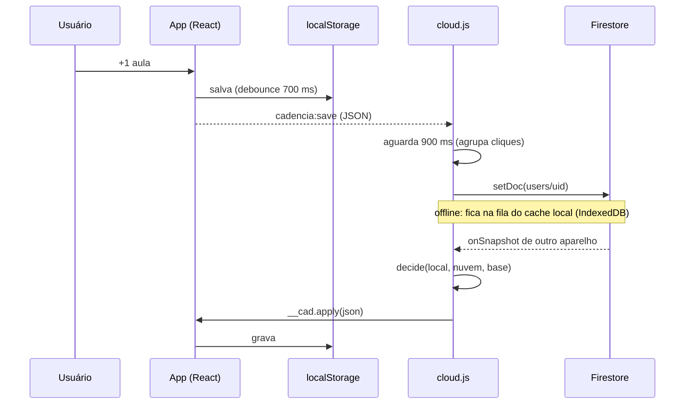

# Arquitetura

O Cadência é um PWA estático: não há servidor próprio. Tudo roda no navegador, e o Firebase oferece identidade (Auth) e persistência remota (Firestore).

## Peças

| arquivo | papel | origem |
|---|---|---|
| `index.html` | interface completa (React 18.3, CSS, fonte Nunito em base64) | bundle esbuild + ganchos aplicados por `scripts/patch-index.mjs` |
| `cloud.js` | conta Google, sincronização, cópias diárias, interface da conta | gerado de `src/cloud/` por `npm run build` |
| `ux.js` | microinterações, tela de abertura, escala para celular | escrito à mão, sem dependências |
| `sw.js` | cache offline do próprio app | escrito à mão |
| `firebase-config.js` | identificadores públicos do projeto Firebase | gerado pelo console/CLI do Firebase |

Ordem de carregamento no `<body>`:

```html
<div id="root"></div>
<script src="firebase-config.js"></script>          <!-- window.CADENCIA_FIREBASE -->
<script>/* fila: __cadMount/__cadChip guardam pedidos até cloud.js chegar */</script>
<script src="cloud.js" defer></script>              <!-- ~200 KB gzip: não bloqueia a primeira pintura -->
<script src="ux.js"></script>                       <!-- pequeno; precisa rodar antes do React (splash, escala) -->
<script>/* app React */</script>
```

## Por que ganchos em vez de reescrever a interface

A interface já existia como bundle compilado. Reescrevê-la só para ligar a nuvem traria risco de regressão nas contas de projeção, que são o núcleo do produto. A opção foi um **contrato mínimo** entre o app e os módulos novos, aplicado por substituição exata de trechos do bundle:

| gancho | direção | para quê |
|---|---|---|
| `window.__cad.get()` | app → nuvem | lê o último JSON salvo |
| `window.__cad.apply(json)` | nuvem → app | normaliza (mesma função do app), troca o estado React e grava no `localStorage`; devolve o JSON normalizado |
| evento `cadencia:ready` | app → nuvem | o estado inicial terminou de carregar |
| evento `cadencia:save` | app → nuvem | cada salvamento local (debounce de 700 ms já existente no app) |
| `window.__cadMount(el)` | app → nuvem | ponto de montagem do cartão da conta em Ajustes |
| `window.__cadChip(el)` | app → nuvem | ponto de montagem do avatar com status na tela Hoje |
| evento `cadencia:goal` | app → ux | uma trilha acabou de bater a meta do dia |

O script `scripts/patch-index.mjs`:

- falha alto se um trecho esperado não existir, ou existir mais de uma vez, em vez de aplicar pela metade;
- é **idempotente**: verifica primeiro se o resultado já está presente, porque vários ganchos contêm o próprio trecho original;
- roda no CI (`npm run patch && git diff --exit-code`) para garantir que o `index.html` versionado está consistente.

Os pontos de montagem são `div`s vazias controladas pelo React. O `cloud.js` preenche o conteúdo com DOM próprio. Como o React não renderiza filhos ali, ele nunca sobrescreve esse conteúdo.

## Fluxo de dados



## Service worker

- **Pré-cache** dos arquivos do app na instalação (`ASSETS`).
- **Stale-while-revalidate:** responde do cache na hora e baixa a versão nova em segundo plano. A atualização aparece na abertura seguinte. Incrementar `CACHE` força a troca imediata.
- **Só a própria origem passa pelo SW.** Requisições ao Google, ao Firestore e ao handler de login (`/__/auth/*` no Firebase Hosting) vão direto para a rede. A primeira versão do SW guardava qualquer GET, o que serviria respostas antigas do Firestore. Isso foi corrigido junto com a nuvem.

## Escala em celular

O bundle usa muitos tamanhos fixos em `px` misturados com `rem`, então aumentar só a fonte deixaria o layout desigual. O `ux.js` aplica `zoom` no `html` por faixa de largura: 1.04 até 374 px e 1.10 de 375 a 540 px. Os títulos de trilha deixaram de ser cortados com reticências e quebram em até duas linhas.

## Limitações conhecidas

- O código-fonte da interface React não está no repositório, só o bundle. Mudanças de interface além dos ganchos exigem editar o bundle ou recuperar o código-fonte (está no roadmap).
- O *merge* opera por trilha e por dia de registro. Edições conflitantes de título ou meta da mesma trilha em dois aparelhos offline ficam com a versão da nuvem.
