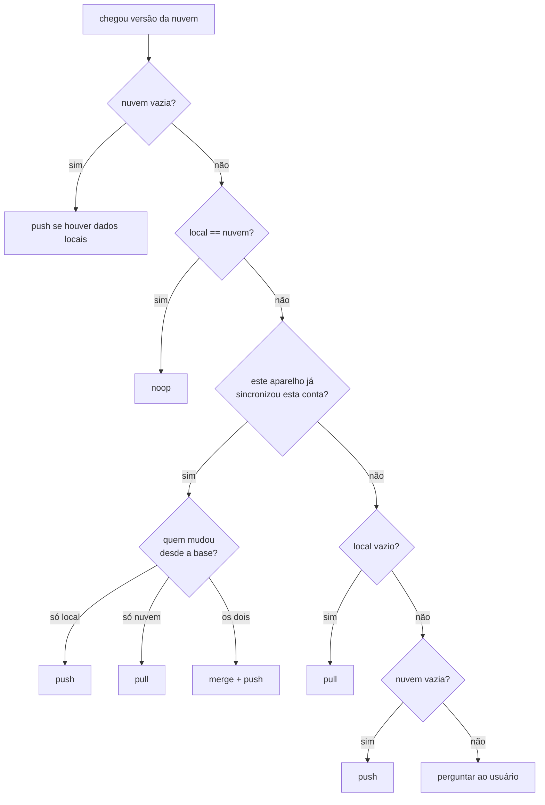

# Sincronização

## Modelo de dados

```
users/{uid}
  data:       string   # JSON do app: { version, kinds[], units[], items[] }
  updatedAt:  timestamp (servidor)
  device:     string   # id aleatório do aparelho que escreveu
  v:          1        # versão do formato

users/{uid}/backups/{AAAA-MM-DD}
  data:       string
  at:         timestamp
```

Cada trilha (`items[]`) tem `id`, metadados (título, total, meta diária, dias da semana…) e `logs: { "AAAA-MM-DD": quantidade }`.

**Por que um documento só, com o estado em string:** o estado de uma pessoa tem poucos KB. Uma escrita atômica do todo evita estados parciais e torna a comparação trivial (igualdade de string). A string também fica imune às restrições de chaves e aninhamento de mapas do Firestore. O limite de 1 MiB por documento é verificado pelas regras (`< 900 000` caracteres).

## Estado local da sincronização

Guardado no `localStorage` do aparelho, na chave `cadencia:cloud`:

| campo | significado |
|---|---|
| `uid` | conta com que este aparelho sincronizou pela última vez |
| `base` | último JSON que este aparelho sabe estar **igual** no aparelho e na nuvem |
| `at` | horário da última sincronização |
| `backupDay` | último dia em que este aparelho gravou a cópia diária |

## Algoritmo: `decide(local, nuvem, base)`

Implementado como função pura em [`src/cloud/sync-core.js`](../src/cloud/sync-core.js) e coberto por [`tests/sync-core.test.mjs`](../tests/sync-core.test.mjs).



A `base` funciona como o ancestral comum de um *merge* de três vias. Sem ela, não dá para distinguir "a nuvem mudou" de "eu mudei", e a última escrita apagaria a outra.

## Mesclagem: `merge(a, b)`

- Trilhas presentes só em um lado são mantidas.
- Na mesma trilha, os registros diários são unidos e, **no mesmo dia, fica o maior valor**. Perder progresso é pior que contar a mais.
- Em campos conflitantes (título, meta, total), vence `a`, que no app é a versão da nuvem.
- Categorias e unidades são unidas, sem repetição.
- É idempotente: `merge(x, x) === x`.

Limitação conhecida: uma trilha apagada num aparelho e editada em outro, ambos offline, volta a aparecer após a mesclagem. Um registro de exclusões resolveria isso; está no roadmap.

## Ciclo de vida

1. **Login** (`signInWithPopup`, com fallback para `signInWithRedirect` se o popup for bloqueado).
2. **Listener** `onSnapshot(users/{uid}, { includeMetadataChanges: true })`:
   - ignora o eco das próprias escritas (`hasPendingWrites`);
   - na **primeira conciliação**, só aceita dado confirmado pelo servidor (não do cache), para não decidir com base em uma cópia velha;
   - espera o app terminar de carregar (`cadencia:ready`) antes de decidir.
3. **Edições locais:** cada `cadencia:save` agenda um envio em 900 ms. Vários toques seguidos viram uma escrita só.
4. **Offline:** o Firestore guarda as escritas em IndexedDB e as envia ao reconectar. O status mostra "Sem internet — as mudanças sobem quando voltar".
5. **Cópia diária:** na primeira escrita de cada dia, grava `backups/{hoje}` e apaga as cópias além das 30 mais recentes.

## Interface de status

| ponto | estado |
|---|---|
| verde | sincronizado (com horário) |
| âmbar pulsando | sincronizando |
| cinza | sem internet |
| coral | erro (mensagem amigável: domínio não autorizado, permissão negada…) |

O avatar no topo da tela Hoje pisca quando chega uma mudança de outro aparelho.

## Como foi testado

- **Unitários** (`npm run test:unit`): todas as saídas de `decide` e as propriedades de `merge`.
- **Regras** (`npm run test:rules`): dono lê e grava; outra conta e visitantes são negados; campos fora do esquema, `data` não-string ou grande demais, e IDs de cópia fora do formato de data são recusados.
- **Integração manual com emuladores:** dois "aparelhos" (duas origens) na mesma conta, cobrindo envio inicial, download em aparelho vazio, edição ao vivo, edição offline nos dois lados com mesclagem, o diálogo do primeiro login e a restauração de cópia diária.
